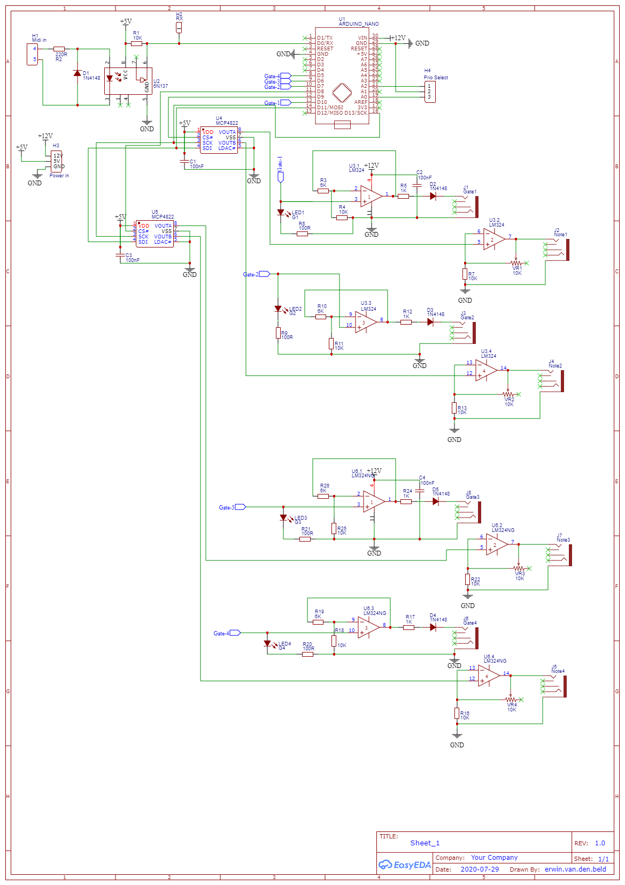

# polyphonicator
Arduino converter for midi to 4 channel polyphonic control voltages. 

- 4x Note CV output (88 keys, 1V/octave) using a 12-bit DAC
- 4x Gate output (5V when note played)

Inspired by [midi2cv](https://github.com/elkayem/midi2cv/) by Larry McGovern.

## Hardware
### Schematic

### Bom
[BOM](hardware/BOM_polyphonicator.csv)

## Software
[Arduino sketch](polyphonicator.ino)